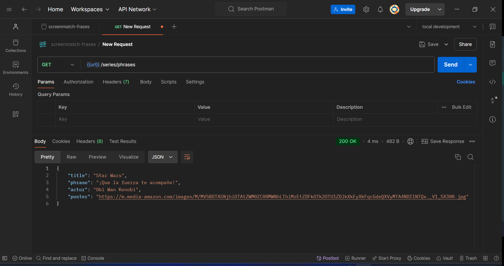
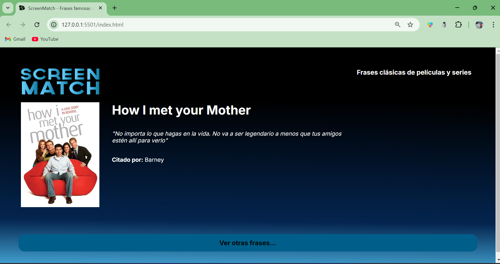
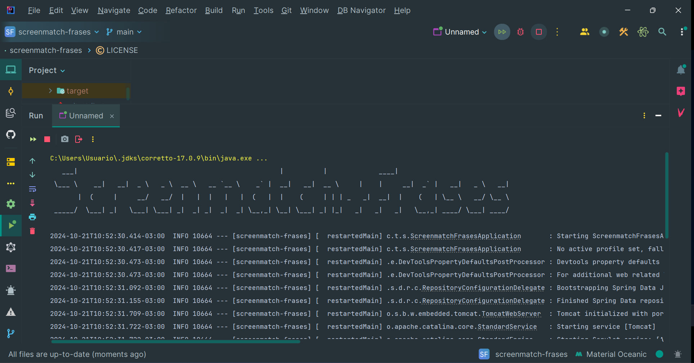
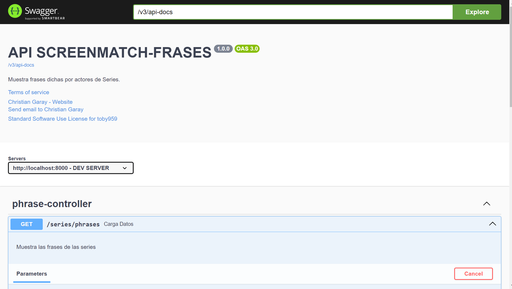
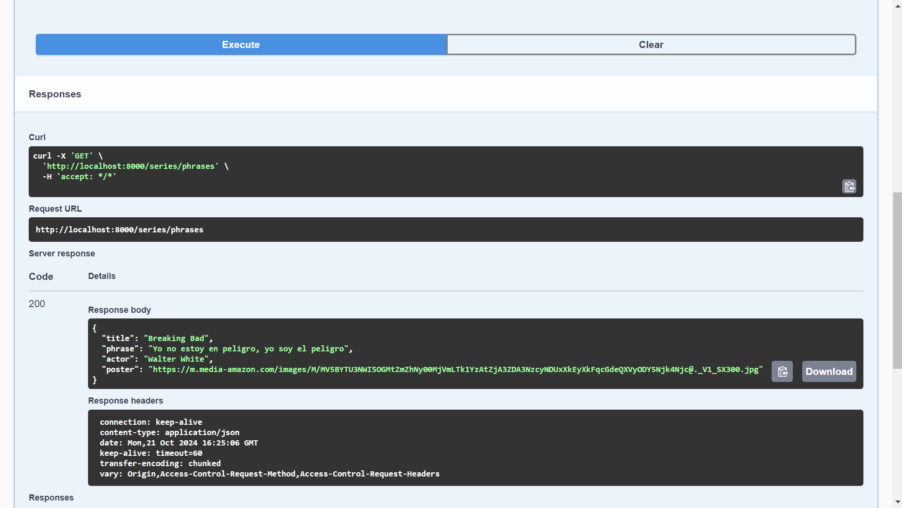

<h1 aling="center"> Screenmatch-frases  </h1>

&nbsp;&nbsp;&nbsp;&nbsp;&nbsp;&nbsp;&nbsp;&nbsp;&nbsp;[](LICENSE)&nbsp;&nbsp;&nbsp;

Descripción 📖   
Este proyecto es una API de películas que almacena en una base de datos (PostgreSQL) los siguientes elementos: título, frase, actor y póster. Estos se integran en un front-end que lo hace más amigable para el usuario.   
___
# Recursos:
| Plugin                       | URL                                                                                      |
|------------------------------|------------------------------------------------------------------------------------------|
| spring-boot-starter-data-jpa | https://mvnrepository.com/artifact/org.springframework.boot/spring-boot-starter-data-jpa |
| spring-boot-starter-web      | https://mvnrepository.com/artifact/org.springframework.boot/spring-boot-starter-web | 
| spring-boot-devtools | https://mvnrepository.com/artifact/org.springframework.boot/spring-boot-devtools |
| postgresql | https://mvnrepository.com/artifact/org.postgresql/postgresql |
___
# Herramientas utilizadas 🛠️
1 - IntelliJ IDEA Community Edition: Un entorno de desarrollo integrado (IDE) para Java que facilita la programación.   
2 - Java versión 17.0.10: La versión del lenguaje de programación Java utilizada en este proyecto.
___

# Ejecutar el Proyecto ⚙️
1 - Clona el repositorio en tu máquina local
``` bash
git clone
<https://github.com/toby959/screenmatch-frases.git>
```
2 - Compila y ejecuta el archivo ScreenmatchFrasesApplication.java.
___
# Funcionalidades 📦
En el front, se proporciona el título de la aplicación, donde se muestra un póster, el título de la serie, la frase a la que hace referencia y el actor que citó dicha frase. Además, posee un botón en la parte inferior que, de forma aleatoria, selecciona una frase de nuestra base de datos. Se agregó al proyecto la colección de Postman con los datos y se colocó una variable en la URL para que sea más reutilizable. También se añadió un ícono a nuestra página de Screenmatch-frases. 
___
# Colaboraciones 🎯
Si deseas contribuir a este proyecto, por favor sigue estos pasos:

1 - Haz un fork del repositorio: Crea una copia del repositorio en tu cuenta de GitHub.  
2 - Crea una nueva rama: Utiliza el siguiente comando para crear y cambiar a una nueva rama:
```bash
git chechout -b feature-nueva
```
3 - Realiza tus cambios: Implementa las mejoras o funcionalidades que deseas agregar.  
4 - Haz un commit de tus cambios: Guarda tus cambios con un mensaje descriptivo:
```bash 
git commit -m 'Añadir nueva funcionalidad'
```
5 - Envía tus cambios: Sube tu rama al repositorio remoto:
````bash
git push origin feature-nueva
````
6 - Abre un pull request: Dirígete a la página del repositorio original y crea un pull request para que revisemos tus cambios.

Gracias por tu interés en contribuir a este proyecto. ¡Esperamos tus aportes!
___
# Imagenes:












## Licencia 📜

Este proyecto está licenciado bajo la Licencia MIT - ver el archivo [LICENSE](https://github.com/toby959/screenmatch-frases/blob/main/LICENSE) para más detalles.